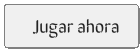
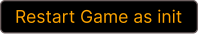
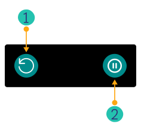
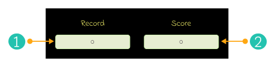

 

 

 

Cambiar a:&nbsp; &nbsp; 

---

# GromaSnake
Este juego de la culebra está desarrollado en **Html, Css** y **JavaScript Vanilla**. &nbsp; &nbsp; 

 

   &nbsp;  &nbsp; &nbsp;
  Detalles del juego:

### Cómo jugar:  &nbsp; &nbsp; 🎮

 > Usando las flechas del teclado o la combinación de teclas WASD, para mover la culebra alrededor del tablero.

 

### Objetivos del juego:  &nbsp; &nbsp; 🎯
> Es llevar a la culebra hasta la comida que la hará crecer, evitando chocar con las paredes del tablero o su propio cuerpo, que haría que el juego termine.

 

### Puntaje:  &nbsp; &nbsp; 🎰
> El juego cuenta con un sistema de puntos, y podrás ver en pantalla cuantos puntos has ganado a lo largo del juego, así cómo tu puntuación más alta conseguida; cuanto más avances, mayor será tu puntaje.
    
 

 

## Funciones:

### Iniciar juego:

Los usuarios pueden iniciar un juego nuevo cuándo quieran. 

> **Ubicación de botones de inicio ( Start ):**   1. Página de inicio.  2. Página de fin de juego.

 

### Reiniciar juego:

Restablece los valores iniciales del juego, dejando en cero el contador de puntaje y record. 

> **Ubicación del botón restart:** &nbsp; Página de inicio.

 

### Recargar y pausar juego:

1. &nbsp;**Recargar:** Se activa con el botón de recarga y redirige a la página de inicio. 

2. &nbsp; **Pausar:** Esta función se activa con el botón de pausa del juego o con la barra espaciadora del teclado.  

> **Ubicación de los botones:** &nbsp; Página de juego en curso.

 

### Mostrar puntaje:

1. &nbsp;**Record** Muestra el puntaje más alto conseguido por el usuario. 

2. &nbsp; **Score** Refleja los puntos que ha obtenido el usuario en la partida actual.  

> **Ubicación del tablero de Record** &nbsp; Página de juego en curso.  **Ubicación del tablero Score:**  1. Página de juego en curso.  2. Página de fin de juego.

 

## Diseño:

 &nbsp; &nbsp;  &nbsp; &nbsp;  Wireframes:

 

> Los Wireframes son prototipos de baja fidelidad (poco detalle) que sirven cómo guía visual y representan el esqueleto de una página y/o componente.

 

## Página de juego en curso:

### Detalles: 

**1. &nbsp; &nbsp; Tablero de puntos:** Muestra el puntaje record ( más alto ) y el puntaje actual que el usuario ha obtenido. 
**2. &nbsp; &nbsp; Tablero:** Es el marco por dónde se mueve la culebra y aparece la comida. 
**3. &nbsp; &nbsp; Botón de recarga:** Redirige a la página de inicio para permitir al usuario iniciar un juego nuevo. 
**4. &nbsp; &nbsp; Botón de pausa:** Permite al usuario pausar el juego ( **Versión de escritorio:** se puede activar con la barra espaciadora del teclado ). 

Diseño de pc/tablet

 

---

 

### Detalles:

> La versión móvil tiene:  
**1. &nbsp; &nbsp; Tablero de puntos:** Muestra el puntaje record ( más alto ) y el puntaje actual que el usuario ha obtenido. 
**2. &nbsp; &nbsp; Tablero:** Es el marco por dónde se mueve la culebra y aparece la comida. 
**3. &nbsp; &nbsp; Botón de recarga:** Redirige a la página de inicio para permitir al usuario iniciar un juego nuevo. 
**4. &nbsp; &nbsp; Botón de pausa:** Permite al usuario pausar el juego ( **Versión de escritorio:** se puede activar con la barra espaciadora del teclado ).  
--> así como:

 

**5. &nbsp; &nbsp; Controladores:** para que el usuario decida la dirección en la que se mueve la culebra dentro del tablero. ( **Versión de escritorio:** se pueden usar tanto la combinación WASD o flechas del teclado ). 

Diseño de móvil ( vertical )

 

---

 

Diseño de móvil ( horizontal )

 

 

## Lenguajes y herramientas:

Usados en el desarrollo del proyecto:

 &nbsp; &nbsp;
 &nbsp; &nbsp;
 &nbsp; &nbsp;

 

Empleados en el diseño del proyecto:

 

## Profesionales:

<a href="https://www.linkedin.com/in/mariangelicarodriguezperez/">

</a>

---

  

© Mariangelica Rodriguez

 &nbsp; &nbsp;
 &nbsp; &nbsp;

 

