

 

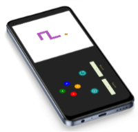

 

 

Cambiar a:&nbsp; &nbsp; 

---

# GromaSnake
Este juego de la culebra está desarrollado en **Html, Css** y **JavaScript Vanilla**. &nbsp; &nbsp; 

 

   &nbsp;  &nbsp; &nbsp;
  Detalles del juego:

### Cómo jugar:  &nbsp; &nbsp; 🎮

 > Usando las flechas del teclado o la combinación de teclas WASD, para mover la culebra alrededor del tablero.

 

### Objetivos del juego:  &nbsp; &nbsp; 🎯
> Es llevar a la culebra hasta la comida que la hará crecer, evitando chocar con las paredes del tablero o su propio cuerpo, que haría que el juego termine.

 

### Puntaje:  &nbsp; &nbsp; 🎰
> El juego cuenta con un sistema de puntos, y podrás ver en pantalla cuantos puntos has ganado a lo largo del juego, así cómo tu puntuación más alta conseguida; cuanto más avances, mayor será tu puntaje.
    
 

 

## Funciones:

### Iniciar juego:

Los usuarios pueden iniciar un juego nuevo cuándo quieran. 

> **Ubicación de botones de inicio ( Start ):**   1. Página de inicio.  2. Página de fin de juego.

 

### Reiniciar juego:

Restablece los valores iniciales del juego, dejando en cero el contador de puntaje y record. 

> **Ubicación del botón restart:** &nbsp; Página de inicio.

 

### Recargar y pausar juego:

1. &nbsp;**Recargar:** Se activa con el botón de recarga y redirige a la página de inicio. 

2. &nbsp; **Pausar:** Esta función se activa con el botón de pausa del juego o con la barra espaciadora del teclado.  

> **Ubicación de los botones:** &nbsp; Página de juego en curso.

 

### Mostrar puntaje:

1. &nbsp;**Record** Muestra el puntaje más alto conseguido por el usuario. 

2. &nbsp; **Score** Refleja los puntos que ha obtenido el usuario en la partida actual.  

> **Ubicación del tablero de Record** &nbsp; Página de juego en curso.  **Ubicación del tablero Score:**  1. Página de juego en curso.  2. Página de fin de juego.

 

<h2 id="design">Diseño:</h2>

 &nbsp; &nbsp;  &nbsp; &nbsp; Colores:

### Paleta de colores:
La paleta de colores usada en el proyecto, incluye colores vibrantes para evocar sensaciones de alegría y energía.

Variaciones de color usadas para crear la paleta de colores.

 

### Detalles de color:
La coherencia del diseño requiere brindar información sobre cada elemento básico, como los colores de la interfaz.

 

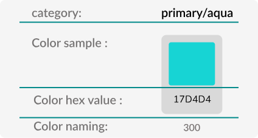

 

- **Category:** muestra la categoría y/o nombre general del color.
- **Color sample:** es la representación visual que corresponde al color.
- **Color hex value:** es el nombre del color en nomenclatura hexadecimal.
- **Color naming:** representa la convención usada para nombrar colores en el sistema de diseño del proyecto.

 

<a href="#design">Volver a la sección Diseño</a>

 

 &nbsp; &nbsp;  &nbsp; &nbsp; Tipografía:

 

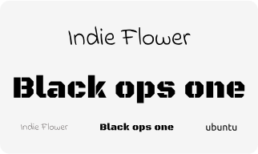

familias tipográficas usadas en la app.

 

Documentación de familias tipográficas en el sistema de diseño.

 

La informción de las familias tipográficas mostrada en el sistema de diseño incluyen: font-family, font-weight, font-size and letter-spacing. Esta es la misma información usada en la maquetación de la app.
 

<a href="#design">Volver a la sección Diseño</a>

 

 &nbsp; &nbsp;  &nbsp; &nbsp; Componentes:

 

Especificaciones del botón de Start mostradas en el sistema de diseño.

 

<a href="#design">Volver a la sección Diseño</a>

 

 &nbsp; &nbsp;  &nbsp; &nbsp;  Wireframes:

 

> Los Wireframes son prototipos de baja fidelidad (poco detalle) que sirven cómo guía visual y representan el esqueleto de una página y/o componente.

 

## Página de juego en curso:

### Detalles: 

**1. &nbsp; &nbsp; Tablero de puntos:** Muestra el puntaje record ( más alto ) y el puntaje actual que el usuario ha obtenido. 
**2. &nbsp; &nbsp; Tablero:** Es el marco por dónde se mueve la culebra y aparece la comida. 
**3. &nbsp; &nbsp; Botón de recarga:** Redirige a la página de inicio para permitir al usuario iniciar un juego nuevo. 
**4. &nbsp; &nbsp; Botón de pausa:** Permite al usuario pausar el juego ( **Versión de escritorio:** se puede activar con la barra espaciadora del teclado ). 

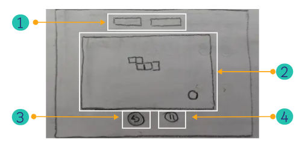

Diseño de prototipo de pc

 

### Wireframe en alta fidelidad:

 

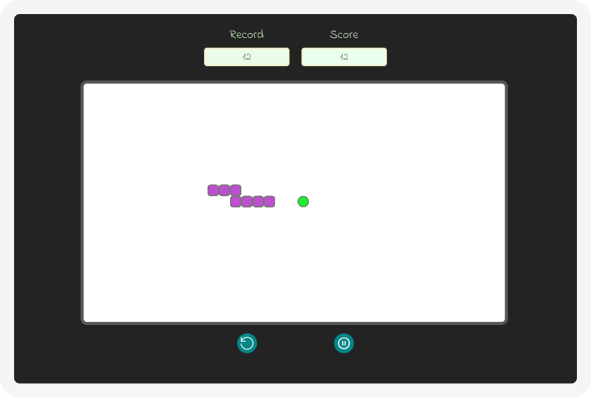

 

<a href="#design">Volver a la sección Diseño</a>

 

---

 

### Detalles:

> La versión tablet y móvil tiene:  
**1. &nbsp; &nbsp; Tablero de puntos:** Muestra el puntaje record ( más alto ) y el puntaje actual que el usuario ha obtenido. 
**2. &nbsp; &nbsp; Tablero:** Es el marco por dónde se mueve la culebra y aparece la comida. 
**3. &nbsp; &nbsp; Botón de recarga:** Redirige a la página de inicio para permitir al usuario iniciar un juego nuevo. 
**4. &nbsp; &nbsp; Botón de pausa:** Permite al usuario pausar el juego ( **Versión de escritorio:** se puede activar con la barra espaciadora del teclado ).  
--> así como:

 

**5. &nbsp; &nbsp; Controladores:** para que el usuario decida la dirección en la que se mueve la culebra dentro del tablero. ( **Versión de escritorio:** se pueden usar tanto la combinación WASD o flechas del teclado ). 

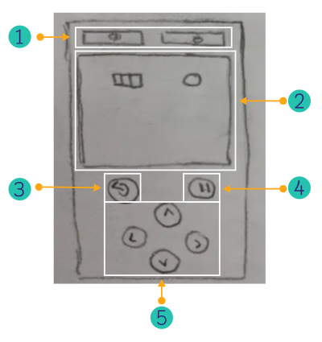

Diseño de móvil/tablet ( vertical )

 

### Wireframe en alta fidelidad:

 

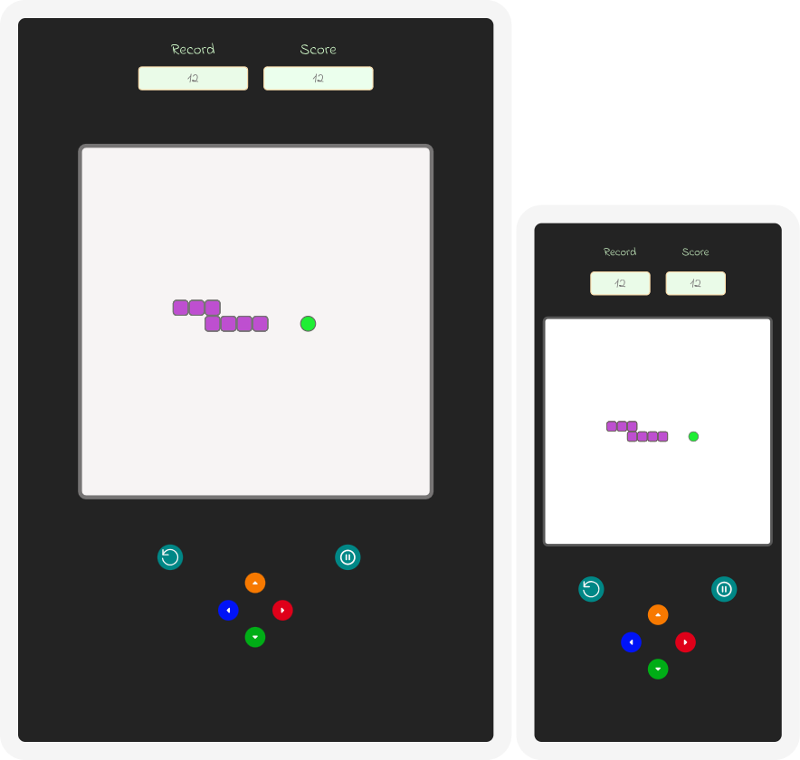

Tablet (izquierda) y móvil (derecha) wireframe en alta fidelidad y en vertical.

 

<a href="#design">Volver a la sección Diseño</a>

 

---

 

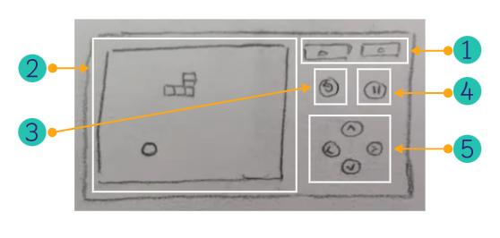

Diseño de móvil ( horizontal )

 

### Wireframe en alta fidelidad:

 

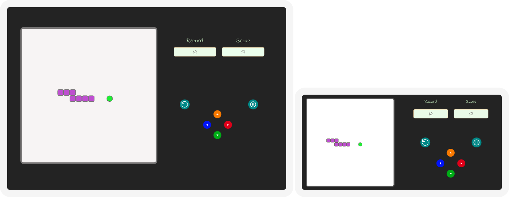

Tablet (izquierda) y móvil (derecha) wireframe en alta fidelidad y en horizontal.

 

<a href="#design">Volver a la sección Diseño</a>

 

 

## Prototipo interactivo

 

<a href="https://www.figma.com/proto/ZbeIXzUzrwc1tMEwDv9W7q/Gromarant?type=design&node-id=465-16080&t=McrzeOVaGhodaHj9-1&scaling=scale-down&page-id=0%3A1&starting-point-node-id=447%3A5614&show-proto-sidebar=1&mode=design" target="_blank">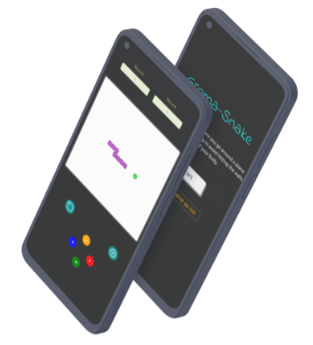
</a>

 

> Haz click en la imagen para probar el prototipo interactivo en Figma. &nbsp; &nbsp; 👆

 

## Lenguajes y herramientas:

Usados en el desarrollo del proyecto:

 &nbsp; &nbsp;
 &nbsp; &nbsp;
<a href="https://developer.mozilla.org/en-US/docs/Web/JavaScript" target="_blank">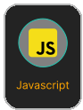</a> &nbsp; &nbsp;
<a href="https://github.com/about" target="_blank">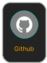</a>

 

Empleados en el diseño del proyecto:

 

## Profesionales:

<a href="https://www.linkedin.com/in/mariangelicarodriguezperez/">

</a>

---

  

© Mariangelica Rodriguez

 &nbsp; &nbsp;
 &nbsp; &nbsp;

 

