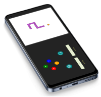
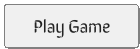
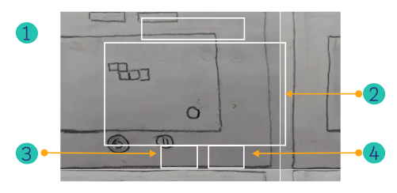
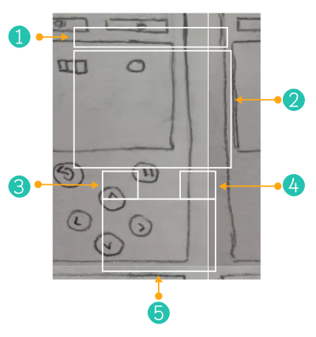
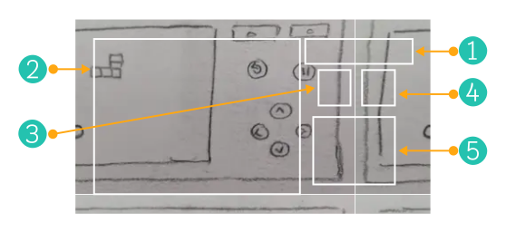
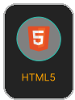
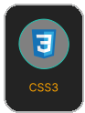
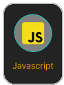
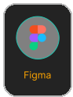

 

 

 

---

# GromaSnake
This Snake Game was written in **Html, Css** and **JavaScript Vanilla**. &nbsp; &nbsp; 

 

   &nbsp;  &nbsp; &nbsp;
  Game details:

### How to play the game  &nbsp; &nbsp; 🎮

 > Use the arrow keys or WDSA key combinations to move the snake around the board.

 

### The objective of the game  &nbsp; &nbsp; 🎯
> It is to guide the snake to the food, which will make it grow in size, while avoiding the walls or the snake's body, as that will end the game.

 

### Points  &nbsp; &nbsp; 🎰
> The game also features a scoring system, so you can see how many points you have earned. The higher your score, the more points you will earn!
    
 

 

## Design:

 &nbsp; &nbsp;  &nbsp; &nbsp;  Wireframes:

 

> Wireframes are prototypes that serve as a visual guide that represents the skeletal framework of the game.

 

## Game page:

### Details: 

**1. &nbsp; &nbsp; Whiteboard:** Renders record ( higher score) and current Score that user achieve. 
**2. &nbsp; &nbsp; Board:** Shows the snake and its food redered. 
**3. &nbsp; &nbsp; Reload button:** Allows the user to restart the game and redirect to the home page. 
**4. &nbsp; &nbsp; Pause button:** Enables user to pause the game ( **Desktop version:** it can be trigger with the keyboard space button ). 

Desktop layout design

 

---

 

### Details:

> The mobile version has  
**1. &nbsp; Whiteboard:** Renders record ( higher score) and current Score that user achieve.  
**2. &nbsp; Board:** Shows the snake and its food redered.  
**3. &nbsp; Reload button:** Allows the user to restart the game and redirect to the home page.  
**4. &nbsp; Pause button:** Enables user to pause the game ( **Desktop version:** it can be trigger with the keyboard space button ).  
--> as well as:

 

**5. &nbsp; &nbsp; Controller:** Allows the user to control the directions that the snake takes around the board ( **Desktop version:** it can be controlled either with the WASD keyboard combination or arrow buttons on the keyboard ). 

Mobile layout design in portrait mode

 

---

 

Mobile layout design in landscape mode

 

 

## Languages and tools:

Use for the project development:

 &nbsp; &nbsp;
 &nbsp; &nbsp;
 &nbsp; &nbsp;

 

Employed in the project design:

 

## Functionalities:

 

## Professionals:

<a href="https://www.linkedin.com/in/mariangelicarodriguezperez/">

</a>

---

  

© Mariangelica Rodriguez

 &nbsp; &nbsp;
 &nbsp; &nbsp;

 

