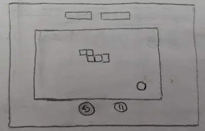
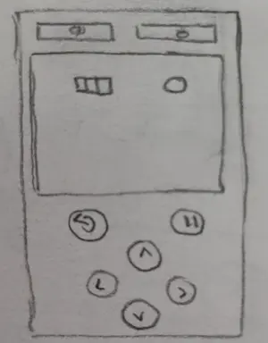
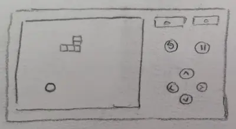

 

 

---

# GromaSnake
This Snake Game was written in **Html, Css** and **JavaScript Vanilla**. &nbsp; &nbsp; 

 

   &nbsp;  &nbsp; &nbsp;
  Game details:

### How to play the game  &nbsp; &nbsp; 🎮

 > Use the arrow keys or WDSA key combinations to move the snake around the board.

 

### The objective of the game  &nbsp; &nbsp; 🎯
> It is to guide the snake to the food, which will make it grow in size, while avoiding the walls or the snake's body, as that will end the game.

 

### Points  &nbsp; &nbsp; 🎰
> The game also features a scoring system, so you can see how many points you have earned. The higher your score, the more points you will earn!
    
 

 

## Design:

   &nbsp;  &nbsp; &nbsp;
  Prototypes:

 

### Wireframes:

These are prototypes that serve as a visual guide that represents the skeletal framework of the game.

 

 &nbsp; &nbsp; See Wireframes:

 

Desktop layout design

 

---

 

Mobile layout design in portrait mode

 

---

 

Mobile layout design in landscape mode

 

